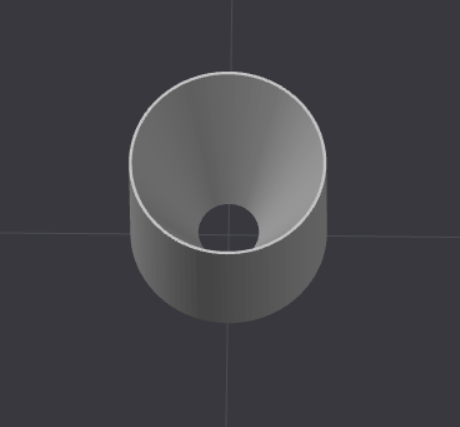

# Feed ramps for PC4-M10 Fittings

My partner in printing, [Ted Kotz](https://github.com/tedkotz), and I built a dry box to house our filaments for printing, which included PC4-M10 fittings to attatch the PTFE tubes and run filament through it. We find this tricky to feed the filament through, as it gets caught on the walls of the fitting. So we made a ramp that fits in it -- basically, a cylinder of the inner diameter of the fitting, and a conical hole cut through it.

## Model details

Very simple OpenSCAD project. Everything is parameterized. 

## Print details

I printed this in PETG. It's probably just fine in PLA. I had some minor adhesion issues, so I printed with a 5mm brim. 

## Other

Here are the fittings used:
- <https://www.amazon.com/dp/B0GG2S9LSQ>
